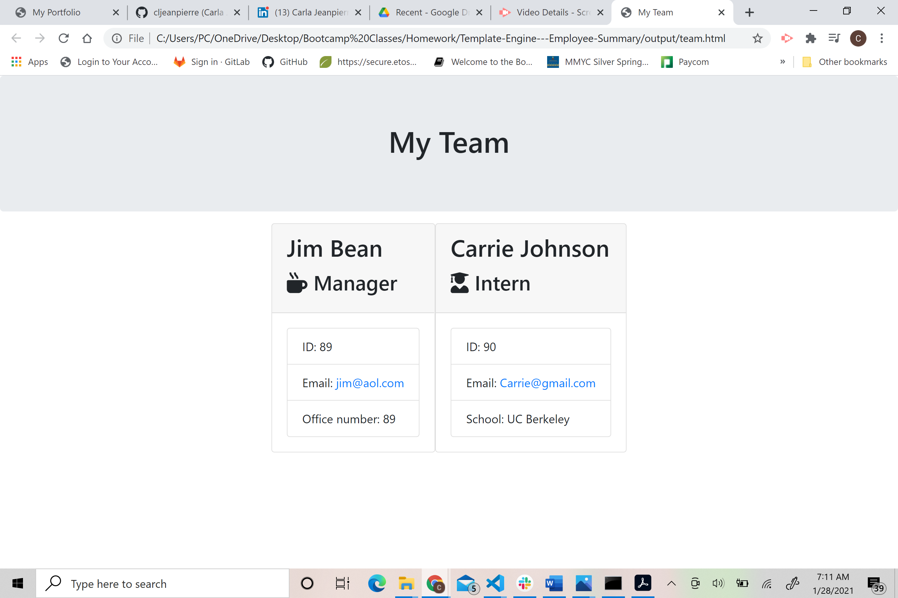

# Template-Engine---Employee-Summary

This project uses a Node Command Line Interface that records information about employees at a software engineering company and generates an HTML webpage that reflects the information for each employee.  Testing is used to ensure that all unit tests pass.  Information input must also pass validation tests.

# User Story

AS A manager
I WANT to generate a webpage that displays my team's basic info
SO THAT I have quick access to emails and GitHub profiles

